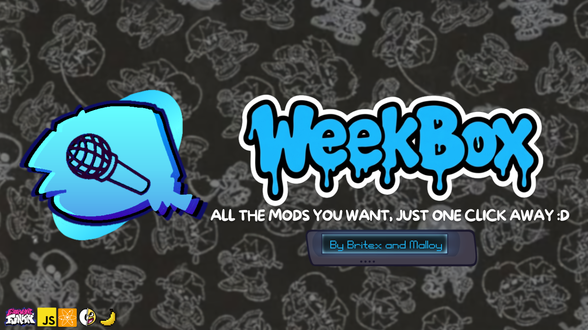

<p align="center">
  
</p>

<p align="center">
  A desktop launcher for discovering, installing, and managing Friday Night Funkin' mods.
</p>

## What it does

WeekBox lets you find Friday Night Funkin' mods, install them in a couple of clicks, and keep your engines and mods organized in one place. Search pulls from GameBanana and Psych Online at the same time. Downloads work through GameBanana, GitHub, Google Drive, and MediaFire. You can also add mods from a folder on your own computer.

Everything you install stays local. WeekBox has no account system and does not upload your library anywhere. See the [Privacy Policy](./PRIVACY.md) for the full list of services it contacts.

## Screenshots

<table>
  <tr>
    <td width="50%">
      <br/>
      <sub><b>Home</b>: browse featured and discoverable mods.</sub>
    </td>
    <td width="50%">
      <br/>
      <sub><b>Mod Manager</b>: see, launch, and organize what you installed.</sub>
    </td>
  </tr>
  <tr>
    <td width="50%">
      <br/>
      <sub><b>Engine Manager</b>: install and switch between engines.</sub>
    </td>
    <td width="50%">
      <br/>
      <sub><b>Settings</b>: storage location, downloads, and updates.</sub>
    </td>
  </tr>
</table>

## Run and build

Install dependencies, then run from source:

```bash
npm install
npm run dev
```

Build release binaries:

```bash
npm run build
```

The launcher icon, window icon, and Credits icon all come from the same source asset in `app/assets/icons/launcher-icon.png`.

## Credits

WeekBox is made by [ImMalloy](https://github.com/ImMalloy) and [Britex](https://github.com/expertyeti).

It is built with [Neutralinojs](https://neutralino.js.org/) and uses [GameBanana](https://gamebanana.com/) and Sniro (Psych Online Site) for mod data.

## Project policies

- [WeekBox Privacy Policy](./PRIVACY.md)
- [Security Policy](./SECURITY.md)
- [Contributing](./CONTRIBUTING.md)
- [Code of Conduct](./CODE_OF_CONDUCT.md)

## License

[MIT](./LICENSE)
