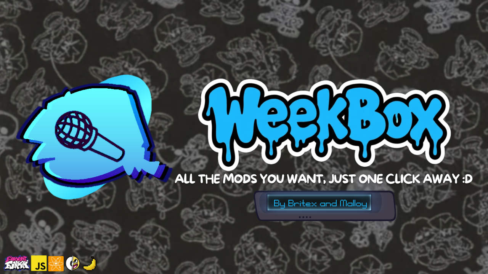
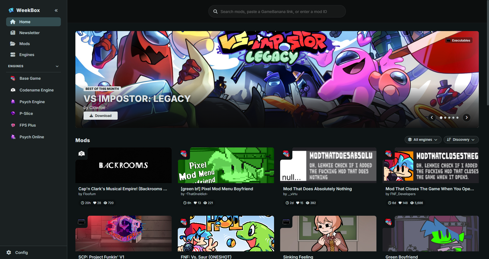

# WeekBox

<p align="center">
  
</p>

<p align="center">
  A desktop launcher for discovering, installing, and managing Friday Night Funkin' mods.
</p>

## Features

- Discover Friday Night Funkin' mods from GameBanana and Psych Online.
- Download from GameBanana, GitHub, Google Drive, and MediaFire.
- Install and organize mods and engines locally.
- Add mods from folders on your computer.
- Install stable and nightly engine builds with release and build details.

WeekBox has no account system. Your installed library stays on your computer.

## Community

- [Discord Server — The Cellar](https://discord.gg/xQTtYF2Cfn)
- [WeekBox on GameBanana](https://gamebanana.com/tools/23228)
- [WeekBox Website](https://fnfweekbox.vercel.app/)
- [News](https://fnfweekbox.vercel.app/news)
- [Downloads](https://fnfweekbox.vercel.app/downloads)
- [Credits](https://fnfweekbox.vercel.app/credits)

Want to work on WeekBox, translate it, or help in another way? Join the
Discord server and DM **Malloy** or **Britex**.

## Screenshots

<table>
  <tr>
    <td width="50%">
      <br/>
      <sub><b>Home</b>: browse featured and discoverable mods.</sub>
    </td>
    <td width="50%">
      <br/>
      <sub><b>Mods</b>: see, launch, and organize what you installed.</sub>
    </td>
  </tr>
  <tr>
    <td width="50%">
      <br/>
      <sub><b>Engines</b>: install and switch between engines.</sub>
    </td>
    <td width="50%">
      <br/>
      <sub><b>Settings</b>: storage location, downloads, and updates.</sub>
    </td>
  </tr>
</table>

## Development

### Setup

1. Install [Node.js](https://nodejs.org/en/download/).
2. Install the Neutralino CLI:

   ```bash
   npm install -g @neutralinojs/neu
   ```

3. From the WeekBox project folder, install dependencies:

   ```bash
   npm install
   ```

4. Update the Neutralino binaries:

   ```bash
   neu update
   ```

`npm install` also runs the project's Neutralino update step. Run `neu update`
again after changing Neutralino versions or when the binaries are missing.

### Run the app

```bash
npm run dev
```

### Rebuild frontend assets

Run this after changing frontend files when you are not already using the asset
watcher from `npm run dev`:

```bash
npm run assets
```

### Build executables

Use this for release builds:

```bash
npm run build
```

You can also run `neu build` directly after running `npm run assets`. The
`npm run build` script runs both commands for you.

See the [development and troubleshooting guide](./docs/DEVELOPMENT.md) if a
setup, update, asset, or build command fails.

## Documentation

- [Development and troubleshooting](./docs/DEVELOPMENT.md)
- [Contributing](./CONTRIBUTING.md)
- [Changelog](./CHANGELOG.md)
- [Code of Conduct](./CODE_OF_CONDUCT.md)
- [Bug report template](./.github/ISSUE_TEMPLATE/bug_report.md)
- [Feature request template](./.github/ISSUE_TEMPLATE/feature_request.md)
- [Pull request template](./.github/PULL_REQUEST_TEMPLATE.md)

## Credits

WeekBox is made by [ImMalloy](https://github.com/ImMalloy) and [Britex](https://github.com/expertyeti).

It is built with [Neutralinojs](https://neutralino.js.org/) and uses [GameBanana](https://gamebanana.com/) and Sniro (Psych Online Site) for mod data.
The rest of the credits can be found [here on WeekBox's website](https://fnfweekbox.vercel.app/credits).
The launcher icon, window icon, and Credits icon all come from the same source asset in `app/assets/icons/launcher-icon.png`.

## License

[MIT](./LICENSE)
