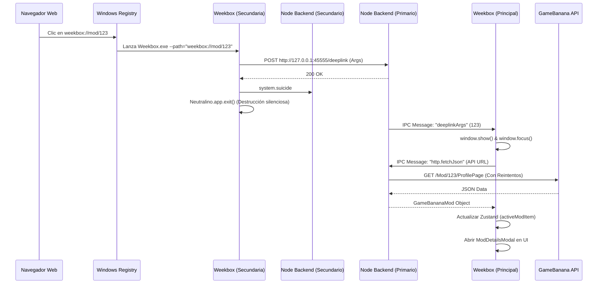

# Sistema de Deeplinks de Weekbox (Protocolo URI)

Este documento detalla el funcionamiento técnico, la arquitectura y el flujo de ejecución del sistema de Deeplinks (`weekbox://`) implementado en Weekbox. 

El sistema permite a los usuarios hacer clic en un enlace desde su navegador (o cualquier otra aplicación) y abrir instantáneamente la ficha técnica de un Mod específico dentro de la aplicación de escritorio de Weekbox.

---

## 1. Introducción y Formato del Enlace

El protocolo personalizado utilizado es `weekbox`. El formato de las URLs soportadas sigue una estructura predecible:

```
weekbox://mod/<id_del_mod>
```

**Ejemplo:**
`weekbox://mod/705198`

### ¿Qué hace cada parte?
- `weekbox://`: Es el esquema (scheme) del protocolo. Le indica al sistema operativo (Windows) que debe interceptar la llamada y buscar qué aplicación está registrada para manejar este prefijo.
- `mod/`: Es el "pathname" o la ruta lógica de la acción. Permite escalar la aplicación en el futuro (ej. `weekbox://engine/123`, `weekbox://play/456`).
- `<id_del_mod>`: Es el identificador numérico único proveniente de GameBanana (ej. `705198`).

---

## 2. Registro en el Sistema Operativo (Windows)

Para que el navegador entienda qué hacer cuando el usuario hace clic en `weekbox://`, Weekbox se registra a sí mismo en el **Registro de Windows (Regedit)** de forma automática al arrancar.

Esto se realiza en el archivo `frontend/src/core/platform/desktop.adapter.ts` mediante la función `Core.os.syncProtocolRegistration()`.

1. La función obtiene la ruta absoluta del ejecutable de Weekbox.
2. Utiliza PowerShell (`window.Neutralino.os.execCommand`) para inyectar subclaves en `HKCU\Software\Classes\weekbox`.
3. Establece el valor `URL Protocol` y configura la ruta `shell\open\command` de la siguiente manera:
   `"C:\Ruta\Hacia\Weekbox.exe" --path="%1"`

> **Nota Crítica:** El argumento `--path="%1"` es una tecnica vital. NeutralinoJS tiene un bug conocido en Windows donde los argumentos enviados desde navegadores web como Google Chrome rompen la inicialización nativa. Al forzar `--path="..."`, engañamos al motor de Neutralino para que parsee la URL del deeplink de forma segura sin corromper el entorno de ejecución del WebView2.

---

## 3. Control de Instancia Única (Single Instance Lock)

Cuando el usuario hace clic en un deeplink, Windows lanza el ejecutable de Weekbox. Sin embargo, si el usuario ya tenía Weekbox abierto, **se lanza un segundo proceso en memoria**. 

Para evitar tener dos ventanas abiertas, implementamos un sistema Híbrido de "Instancia Única" respaldado por un servidor HTTP en Localhost y Heartbeats. Todo esto se coordina en el hook `useDeeplinkManager.ts`.

### El Servidor HTTP Local (Puerto 45555)
El backend de Node.js (la extensión de Neutralino) de la **primera instancia** levanta un servidor HTTP ultraligero usando el módulo nativo `node:http`.
- **Archivo:** `extensions/backend/node/deeplink/deeplink.mjs`
- **Puerto:** `45555`
- **Ruta:** `POST http://127.0.0.1:45555/deeplink`

### El Flujo de Resolución de Instancias
1. El **Segundo Proceso** (recién lanzado) arranca e inmediatamente ejecuta `bootSingleInstanceLock()` en React.
2. Intenta hacer un `fetch` a `http://127.0.0.1:45555/deeplink` enviando sus propios argumentos de inicio.
3. **Escenario A (Hay otra ventana abierta):**
   - El fetch tiene éxito (Código 200 OK).
   - El segundo proceso sabe que NO es el principal.
   - Envía el comando IPC `system.suicide` a su propia extensión de Node para matarla limpiamente.
   - Llama a `Neutralino.app.exit()` para destruir su propia ventana C++ de forma instantánea.
4. **Escenario B (Es la primera ventana):**
   - El fetch falla instantáneamente con `ERR_CONNECTION_REFUSED` (porque el puerto 45555 está libre).
   - El proceso sabe que es el principal.
   - Pasa a cargar la interfaz, arranca su propio servidor en el puerto 45555 y procesa el deeplink para sí mismo.

### Prevención de Zombies (Heartbeat)
Si la primera ventana se cierra haciendo clic en la "X", el proceso C++ de Neutralino muere de forma abrupta, lo que podría dejar el servidor Node.js corriendo como un "Zombie" atascando el puerto 45555 para siempre.
- Para prevenirlo, el Frontend (`DesktopAdapter`) envía un comando `system.ping` al Backend cada 5 segundos.
- En `host.mjs`, si pasan más de 10 segundos sin recibir un ping, el Backend asume que la ventana fue asesinada y llama a `process.exit(0)`, liberando el puerto y garantizando la estabilidad del gestor de deeplinks.

---

## 4. Comunicación Inter-Proceso (IPC) y Ciclo de Vida Visual

Una vez que la instancia principal (la que se quedó abierta) recibe la petición en su servidor HTTP (`45555`), ocurre lo siguiente:

1. El Backend Node parsea la URL y usa `extContext.sendMessage("deeplinkArgs", ...)` para enviarle los datos al Frontend a través de la conexión WebSocket de Neutralino.
2. El Frontend (`useDeeplinkManager`) captura el evento `deeplinkArgs`.
3. Parsea el identificador numérico (Ej: `705198`) mediante `Core.os.parseDeeplinkArgs()`.
4. **Control de Ventana en Windows (DWM Fixes):**
   - El sistema llama a `window.show()`, `window.unmaximize()` y `window.focus()`.
   - Esto saca a Weekbox de la barra de tareas si estaba minimizado o escondido, atrayéndolo hacia la vista del usuario de forma brusca e ineludible.
   - Si es el arranque inicial (`isStartup`), también llama a `setSize` y `center` antes de `show` para eludir un bug nativo del *Desktop Window Manager* de Windows que vuelve a la ventana invisible al usar `"center": true` y `"hidden": true` juntos en el `neutralino.config.json`.

---

## 5. Extracción de Datos (GameBanana API) y Renderizado

Una vez que el ID del mod ha sido extraído y la ventana está frente al usuario, el gestor deposita el ID en el almacén global (Zustand Store) como `activeModId`.

1. **Reacción del Estado:** Un `useEffect` en el gestor detecta la llegada del ID.
2. **Petición HTTP Robusta:** Llama a `Core.services.gamebanana.getModById(id)`.
   - Esta llamada no se hace en el navegador (para evitar bloqueos CORS), sino que se delega de nuevo al Backend de Node.js mediante IPC (`http.fetchJson`).
   - El backend invoca la API `apiv11` de GameBanana (`/Mod/<id>/ProfilePage`).
   - **Tolerancia a fallos:** Se utiliza un límite de tiempo agresivo de **30 a 45 segundos** por si el CPU o el servidor están lentos, e incluye **lógica de reintento automático (Retry)** en caso de que GameBanana esté saturado y devuelva errores temporales como `429 Too Many Requests` o `503 Service Unavailable`.
3. **Mapeo:** La respuesta en bruto es validada para asegurar que pertenezca a Friday Night Funkin' y es convertida a nuestra interfaz `GameBananaMod`.
4. **Despliegue Visual:** 
   - El Mod parseado se inyecta en `activeModItem` del almacén global.
   - El componente `<Home />` detecta este objeto y lo enlaza directamente al estado interno `selectedCard`.
   - Esto desencadena la apertura inmediata del `<ModDetailsModal />`, revelando el mod al usuario con sus screenshots, descripción e información lista para descargar.

---

## 6. Resumen del Flujo Completo


