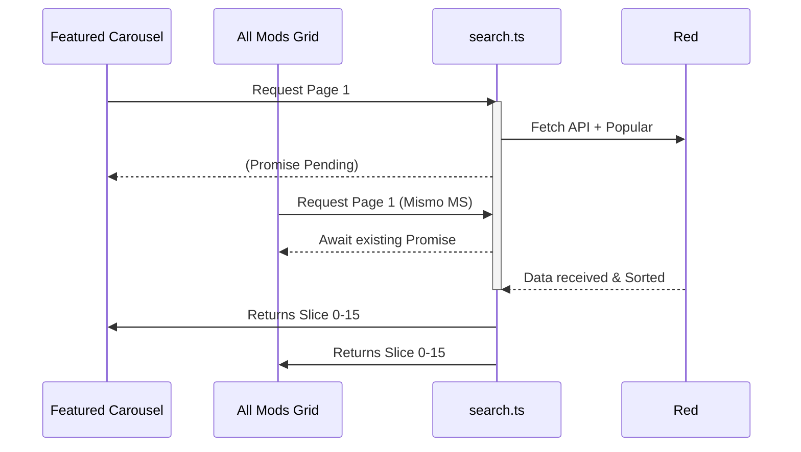
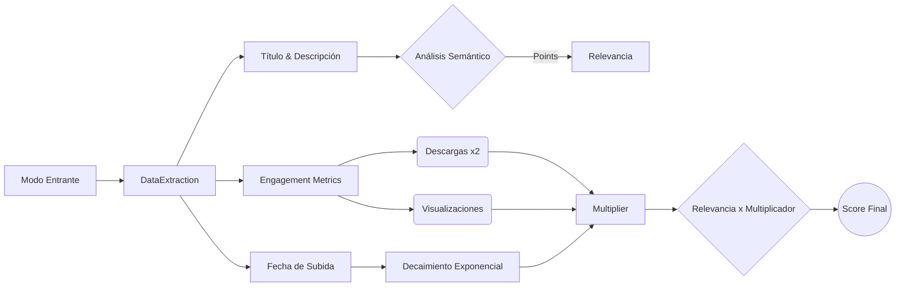

# Weekbox Advanced Search Engine (WASE)

Este documento detalla la arquitectura, el flujo de trabajo y las matemáticas detrás del motor de búsqueda híbrido implementado en Weekbox. Este motor fue creado para resolver las deficiencias graves del sistema nativo de GameBanana y proporcionar una experiencia de descubrimiento de mods al nivel de los estándares modernos de la industria (similar al algoritmo de recomendaciones de YouTube).

---

## 1. El Problema a Resolver

La API nativa de GameBanana (`Util/Search/Results`) presenta fallos críticos de diseño que arruinaban la experiencia del usuario final:

1. **Tokenización Frágil:** El buscador nativo falla al procesar signos de puntuación. Una búsqueda de `"mario madness"` fallará catastróficamente en encontrar `"Mario's Madness"` debido al apóstrofe, excluyendo el mod real de los resultados.
2. **Carencia de Ponderación de Engagement:** GameBanana no ordena sus resultados por descargas, likes o vistas. Una búsqueda devuelve copias baratas, ports recientes o spam que casualmente coinciden con el texto, sepultando los mods originales e históricos.
3. **Condición de Carrera en la Interfaz:** Al montar arquitecturas modernas en React (como un Carrusel Destacado y una Cuadrícula Infinita solicitando datos al mismo tiempo), la caché paginada se corrompía, resultando en retornos vacíos (`[]`) y provocando la desaparición de las "cards" de la interfaz.

---

## 2. La Solución Arquitectónica

Para resolver esto, creamos el **Weekbox Advanced Search Engine (WASE)**, un sistema de caché inyector híbrido. En lugar de depender exclusivamente de GameBanana, WASE descarga en segundo plano los 300 mods más populares de toda la historia y los combina con los resultados de la API. Luego, todo este bloque de datos se filtra y ordena localmente en la memoria RAM del usuario usando Inteligencia Artificial Semántica básica.

### Diagrama General del Flujo Híbrido

```mermaid
graph TD
    User([Usuario ingresa "mario madness"]) --> Input{React Components}
    Input -->|Carrusel| SearchController[search.ts]
    Input -->|Grid Infinito| SearchController
    
    SearchController --> Lock[Concurrency Lock Promise]
    
    Lock -->|Fetch Paginado x5| GBAPI[GameBanana Search API]
    Lock -->|Inyección Silenciosa| PopularCache[(Caché de Top 300 Populares)]
    
    GBAPI -->|75 Resultados Nativos Basura| MergePool
    PopularCache -->|300 Mods Históricos| MergePool
    
    MergePool((Pool Combinado de Mods)) --> NLPFilter[Filtro Semántico NLP]
    NLPFilter -->|Elimina Relevancia 0| ScoreEngine[Motor de Puntuación Matemático]
    
    ScoreEngine --> Deduplicate[Deduplicación de IDs]
    Deduplicate --> ClientCache[(Caché de Búsqueda Local)]
    ClientCache --> UI(Renderización React UI)
```

---

## 3. Resolución de Concurrencia (Race Conditions)

Dado que Weekbox renderiza banners y cuadrículas a la vez, se implementó un candado asíncrono (`currentFetchPromise`). 



Este candado asegura que sin importar cuántos componentes soliciten la misma página en el mismo milisegundo, la red solo se satura una vez, y todos reciben los datos matemáticamente correctos al unísono.

---

## 4. Motor Matemático de Ponderación (Inspirado en YouTube)

Una vez que tenemos el **Pool Combinado** (Resultados + Top Histórico), ordenamos los elementos utilizando una fórmula simplificada basada en el sistema de Recomendación de YouTube (Deep Neural Networks for YouTube Recommendations).

### 4.1. Coincidencia Semántica Estricta (NLP Tokens)

El query del usuario se divide en tokens alfanuméricos puros. 

- **Match Exacto Limpio (+50 Puntos):** Si el query condensado (`mariomadness`) existe en el título condensado (`mariosmadness`), gana 50 puntos.
- **Match por Tokens:** Si el título contiene "mario" (+10 pts) y "madness" (+10 pts). Si la metainformación profunda contiene "mario" (+2 pts).

**Restricción Estricta Anti-Spam:** El algoritmo implementa un cerrojo que exige que **al menos una palabra de la búsqueda exista en el título del mod**. Si solo coincide con el nombre del autor o la descripción técnica, el mod recibe **0 Puntos de Relevancia** y es expulsado. Esto evita falsos positivos donde mods masivamente populares (como *Ankha Zone*) secuestraban los banners solo por tener una palabra irrelevante en su código.

### 4.2. Example Age (Decaimiento de Frescura)

Un mod reciente necesita visibilidad para no ser aplastado por mods con millones de vistas. Sin embargo, no puede superar a los titanes. Se aplica un decaimiento exponencial:

$$ Frescura = e^{(-\frac{EdadEnDias}{60})} \times 50,000 $$

- Un mod subido **hoy** recibe ~50,000 puntos virtuales.
- Un mod subido hace **60 días** recibe ~18,300 puntos.
- Un mod de hace **4 años** recibe ~0 puntos.

### 4.3. Fórmula Final de Puntuación

$$ Score = Relevancia \times ((Descargas \times 2) + Visualizaciones + Frescura) $$

### Diagrama del Flujo de Puntuación



## 5. Resumen de Beneficios

- **Búsquedas de Calidad Garantizadas:** Al inyectar el Top 300 histórico local, el buscador de Weekbox es invulnerable a los fallos de indexación de GameBanana (como los apóstrofes).
- **Cero Duplicados:** Una capa final `Set` evalúa y extrae los `idRow` duplicados generados por la superposición de GameBanana y la caché local.
- **Paginación Falsa Ultrasuave:** Ya que 375 mods se cargan en la `Chunk 0`, las siguientes docenas de "páginas" que solicita la interfaz gráfica son cortes de array en RAM instantáneos (`.slice()`), proporcionando un scroll infinito libre de tiempos de carga en red para el 90% del tiempo de uso.
